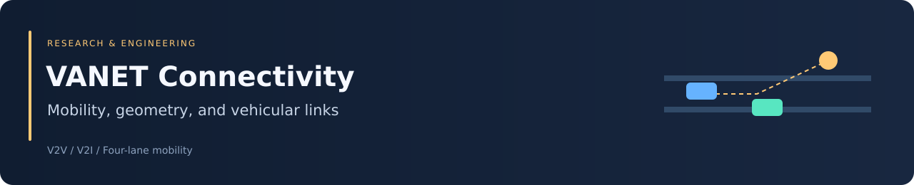

<div align="center">



# VANET Connectivity & Mobility

### MATLAB experiments in vehicle connectivity and traffic dynamics


[Overview](#overview) · [Simulations](#simulation-models) · [Setup](#getting-started) · [Interpretation](#results-and-interpretation)

</div>

## Overview

This repository contains MATLAB demonstrations of vehicle-to-vehicle communication, vehicle-to-roadside-unit connectivity, and four-lane freeway mobility. Links are determined from vehicle positions and a distance threshold.

The repository name refers to cooperative MAC research. **The committed MATLAB implementation is a mobility and connectivity prototype, not a complete packet-level MAC protocol simulator.** It does not establish protocol reliability or efficiency through throughput, delay, or packet-delivery measurements.

## Repository guide

| File | Role |
|---|---|
| [V2V.m](V2V.m) | Interactive roads, three moving vehicles, and pairwise range checks |
| [V2I.m](V2I.m) | Three connected road segments, a moving vehicle, and two roadside units |
| [VANET_mobility.m](VANET_mobility.m) | Four-lane mobility, neighbor statistics, and density-sweep plots |
| [CNN notebook](CNN_hands_on_ipynb_txt.ipynb) | Independent machine-learning notebook |
| [Psychological analytics notebook](Predictive_Analytics_for_Psychological_Outcomes_with_Blockchain_Data_Integrity.ipynb) | Independent analytics notebook |

The two notebooks are separate materials and are not dependencies of the VANET simulations.

## Simulation models

### Distance-based connectivity

For locations $\mathbf p_i=(x_i,y_i)$ and $\mathbf p_j$, the geometric link rule is

$$
\operatorname{connected}(i,j)=
\mathbb{1}\!\left[\lVert\mathbf p_i-\mathbf p_j\rVert_2\le R\right].
$$

The interactive V2V/V2I routines use a threshold of 100 coordinate units. The freeway simulation uses a communication range of 50 with road coordinates described in meters. The interactive examples do not provide a calibrated physical radio model.

### Freeway defaults

| Setting | Source value |
|---|---|
| Road length | 5,000 meters |
| Lanes | Four |
| Initial vehicles per lane | 100 to 500, in steps of 50 |
| Repetitions per density | Five |
| Duration parameter | Two minutes |
| Speed initialization | 22.35–31.29 m/s |
| Acceleration initialization | 0–5 m/s² |
| Safety-distance parameter | 10 meters |
| Arrival/departure probability checks | 0.833 per outer-loop check |

The code includes position updates, car-following rules, lane changes, ramps, boundary reinsertion, and a randomly selected target vehicle. The parameter values describe the implementation; they are not a validated traffic calibration.

## Getting started

Use desktop MATLAB with the Statistics and Machine Learning Toolbox for the interactive routines' `pdist` calls.

```bash
git clone https://github.com/Foysal-A-Al/A-Novel-Cooperative-MAC-Protocol-for-VANETs-that-is-Both-Reliable-and-Efficient.git
```

Set MATLAB's Current Folder to the cloned repository. Run one experiment at a time:

```matlab
rng(42);
V2V
% Alternatively: V2I or VANET_mobility
```

For V2V, follow the dialogs to define two roads. For V2I, define three road segments and two RSU locations. The functions wait for mouse input; a paused figure is not necessarily an error.

Choose nonvertical, nonparallel road segments with enough horizontal extent. The interactive geometry uses slopes and line intersections, so vertical segments, parallel lines, or very short paths can cause invalid coordinates or empty trajectories.

## Results and interpretation

The interactive routines animate vehicles and draw temporary links when the range condition is satisfied. The mobility routine produces plots titled average V2V connectivity, duration of the same three neighbors, and average same-neighbor count over 30 seconds.

Treat these as **implementation outputs requiring validation**, not established network performance:

- The nested time loops include both endpoints; elapsed-time counts and averaging denominators need reconciliation.
- The cumulative-neighbor union used before intersection does not independently verify persistence of the same specific neighbors.
- The car-following helper uses the number of array columns in its loop bound; its vehicle-wise behavior requires review.
- V2I uses different branch ordering after the first road segment, so nearest-RSU selection is not consistently applied.
- Propagation, interference, packet queues, collisions, scheduling, acknowledgments, and retransmissions are not modeled.

No automated tests, validated reference traces, or reproducible MAC benchmark results are included.

## Reproducibility and troubleshooting

Record the Git commit, MATLAB/toolbox versions, random seed, clicked coordinates, and any edited parameters. Seeds control stochastic draws but do not record interactive geometry or guarantee timing behavior.

| Symptom | Check |
|---|---|
| `pdist` unavailable | Statistics and Machine Learning Toolbox installation |
| Figure appears idle | Pending dialog or `ginput` clicks |
| Invalid trajectory | Vertical/parallel segments or insufficient path extent |
| Results differ | Random seed, selected geometry, and parameter edits |
| Mobility run is slow | Density range, repetition count, and duration |

MATLAB execution was not verified as part of this README update. The research source files are preserved.

## Research use and attribution

Cite the repository URL and exact commit used, and document the simulation assumptions separately. The repository title alone does not establish a published paper or a validated MAC protocol.

Maintained by [Abdullah Al Foysal](https://github.com/Foysal-A-Al). No license file is currently included; clarify reuse permissions before redistribution.
